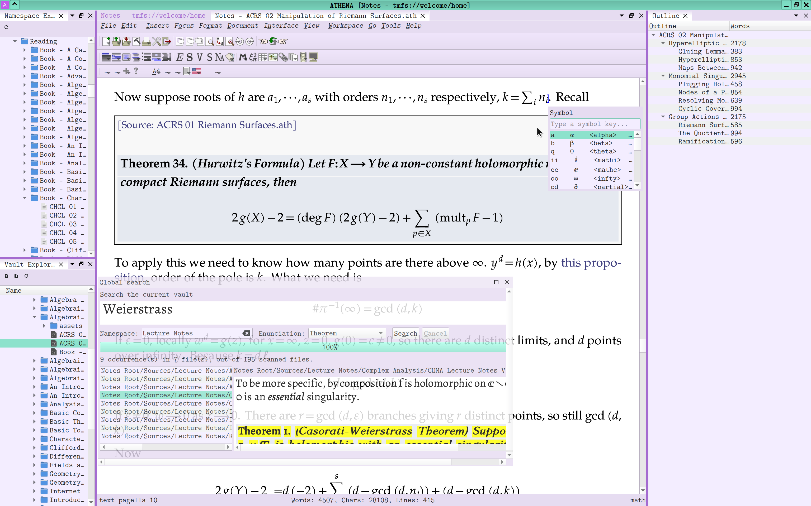

# ATHENA

<p align="center">
  
</p>

**Advanced Typesetting and Hypertext Environment for Notes and Archives**

ATHENA is a mathematics-centered knowledge work environment built from GNU
TeXmacs. It combines high-quality structured WYSIWYG typesetting with vaults,
wikilinks, transclusions, namespaces, semantic artifacts, fast search, remote
computation delegation, and import tooling for large Obsidian-style
mathematical note collections.



## Warning: ATHENA Is Not For Everyone

Use ATHENA only if you are disappointed with **both LaTeX and Obsidian**.

ATHENA is not a LaTeX editor, not an Obsidian clone, and not a conservative
TeXmacs distribution. It is an experimental research notebook and mathematical
knowledge infrastructure. It assumes that you want semantic mathematical
documents, native typesetting, cross-document structure, vault-wide operations,
and deep customization more than you want broad ecosystem compatibility.

If plain Markdown is enough, use Obsidian. If batch typesetting and source-text
control are enough, use LaTeX. ATHENA exists for the uncomfortable middle:
interactive mathematical writing at scale.

## What ATHENA Is

ATHENA is a fork of GNU TeXmacs with major changes:

- The application and runtime tree are rebranded as ATHENA.
- The default document format uses `.ath`.
- The user configuration directory is `~/.ATHENA`.
- The executable is `ATHENA.bin`.
- ATHENA introduces AST nodes and runtime behavior that upstream TeXmacs does
  not understand.

ATHENA can still benefit from TeXmacs' core strengths: structured documents,
native mathematical editing, high-quality layout, TeX-style fonts, Guile/Scheme
extension support, and a deep style system. The project also inherits decades
of work by Joris van der Hoeven and the GNU TeXmacs contributors.

## Major Features

### ATHENA 0.8 Highlights

ATHENA 0.8 strengthens the connection between mathematical documents and the
knowledge they cite, define, and publish. It also replaces a foundational
legacy runtime and makes several large-vault operations genuinely incremental.

- Replace the inherited BibTeX workflow with vault-native Materials: a
  UUID-backed SQLite catalog, managed attachments, reviewed metadata
  recognition, Hayagriva/CSL citations, BibTeX import, and Zotero Local API
  bulk import.
- Preserve Artifact identities across document edits and safe renames, then
  turn artifact names into fast radioactive links with inflection handling,
  mathematical eponym normalization, and same-name disambiguation pages.
- Draw a symbol in the Handwritten Symbol pane and insert a ranked ATHENA math
  command using the pinned Hand TeX classifier and native ncnn inference.
- Replace Guile 1.8 with ATHENA's private Guile 3 runtime, including native
  module/lazy-definition compatibility, parallel incremental Scheme bytecode,
  and a tuned private parallel garbage collector.
- Replace document-tree heading fold buttons with right-side Mathematica-style
  cell brackets, and modernize generated websites around direct, content-first
  pages with floating navigation tools rather than an iframe desktop shell.
- Cache namespace ontology and membership incrementally, reuse backing pixels
  during smooth scrolling, reduce startup work, and make first-use namespace
  exploration non-blocking and visibly indexed.
- Improve Wayland scaling and native menu placement, add in-process restart,
  and replace decorative splash screens with compact native progress windows.
- Tighten LaTeX, HTML, PDF, transclusion, slideshow, and delimiter export paths
  while retaining lossless ATHENA-specific structure where external formats
  cannot represent it directly.

### Vaults

ATHENA vaults are self-contained mathematical knowledge bases.

- Load and track a current vault through `Vaultfile.json`.
- Resolve document and anchor UUIDs through the non-temporal `map.sqlite`
  database, with automatic migration from legacy `Vaultfile` and `map.tmdb`
  data.
- Use `.ath` as the primary ATHENA document format.
- Keep vault-scoped preferences in addition to global preferences.
- Open recent vaults and optionally auto-open vault startup pages or one-time
  startup pages.
- Edit `Vaultfile.json` metadata, map database paths, namespace database paths, local
  preference paths, startup pages, maintenance summary folders, and RAG index
  paths from Preferences.
- Browse vault contents in native Qt ADS panes.
- Compare two `.ath` files side by side using a tree-aware structural diff
  with character-level highlighting inside corresponding text nodes.
- Safely rename vault files and directories with an operation preview,
  crash-recoverable UUID map updates, and structural rewriting of affected
  local asset references while preserving relative paths.
- Use a vault quick switcher, command palette, outline pane, backup viewer, and
  error messages pane.
- Configure multiple asynchronous one-way backup mirrors with save,
  maintenance, or idle triggers.
- Persist ADS pane layout across sessions.
- Check GitHub releases at startup, when enabled in Preferences, and show an
  ATHENA toast when a newer release is available.

### Wikilinks

ATHENA supports Obsidian-like links adapted to structured mathematical
documents.

- Link to files and anchors through stable UUID-backed mappings.
- Insert wikilinks through a Qt wizard.
- Locate targets by choosing a file first or by vault-wide search.
- Preview target context using an embedded rendered ATHENA preview.
- Filter link search by namespace and target kind, including headings,
  paragraphs, and enunciations; optionally use case-insensitive and fuzzy
  matching.
- Select indexed enunciations and bold-text definitions from the Artifacts
  database, with rendered previews and confirmed anchor creation for
  definitions that do not yet have a reusable range.
- Configure default wikilink display text templates separately for files,
  headings, and anchors.
- Repair and resolve links when filenames or anchors move.
- Repair broken transclusions by updating the UUID anchor map instead of
  reinserting content.
- Render card links for files, PDFs, external links, and TMFS destinations.

### Transclusions

ATHENA can embed content from another document into the current one.

- Transclude theorem-like enunciations.
- Transclude arbitrary ranges between anchors.
- Use preview-backed Qt insertion workflows.
- Jump from a transclusion back to its source.
- Detect cycles to avoid recursive rendering failures.
- Preserve source enunciation colors inside transclusion boxes.

### Materials And Citations

Materials are ATHENA's vault-native replacement for the legacy TeXmacs
BibTeX bibliography subsystem.

- Keep books, articles, chapters, theses, reports, slides, and other source
  records in a normalized vault-local SQLite database with stable UUIDs.
- Configure the database path independently in `Vaultfile.json`; it defaults
  to `materials.sqlite` at the vault root.
- Copy dropped source documents into a separately configured `materials/`
  folder and rename generic inputs such as `paper2.pdf` to readable canonical
  creator-year-title filenames.
- Extract local metadata and identifiers with configurable tools, optionally
  enrich DOI, ISBN, arXiv, and PMID records through external providers, and
  review uncertain results before accepting them.
- Deduplicate by file hash and normalized identifiers, merge records while
  retaining UUID aliases, and search titles, creators, identifiers, abstracts,
  and tags through SQLite FTS.
- Edit Zotero-compatible item types, fields, creator roles, identifiers, tags,
  provenance, and managed attachments in the Materials manager ADS pane.
- Import `.bib` files through the pinned Hayagriva engine without reviving the
  old bibliography runtime.
- Bulk-import personal and group libraries through Zotero's official Local API,
  preserving typed metadata and optionally copying locally available file
  attachments with source-key and identifier deduplication.
- Insert UUID-backed citations with typed locators and open Materials through
  `tmfs://material/UUID` links.
- Insert referenced Materials lists that combine automatically cited records
  with manually included reading, then render citations and lists using CSL.
- Preserve exact citation and referenced-list AST through LaTeX
  `ATHENA-DATA` object injection while still exporting useful visible LaTeX.

### Namespaces

Namespaces are one of ATHENA's central knowledge-organization features. They
classify files by filename templates rather than filesystem folders.

Namespace support includes:

- Abstract, semi-concrete, and concrete namespaces.
- SQLite-backed namespace persistence inside vaults.
- Template derivation checks for parent/subspace inference.
- Explicit and derived parent relationships.
- Concrete namespace style paths and initial-content templates.
- Namespace manager ADS pane with wizard-based creation/editing.
- Namespace explorer ADS pane.
- Optional vault root namespace stored in `Vaultfile.json`, with startup validation
  and a namespace explorer mode that shows only that root at the top level.
- Optional namespace explorer simplification that folds redundant descendants
  under an ellipsis branch when a shorter containment path is already visible.
- Namespace TMFS pages: `tmfs://ns/name`.
- Technical summaries via `tmfs://ns/!name`.
- Optional namespace homepages written as `.ath` documents.
- Dynamic homepage tags such as namespace name, type, parents, children,
  filename template, sorter, matches, and technical-summary link.
- Namespace-aware quick switcher.
- Namespace-aware global search.
- Namespace-aware file creation.
- Neighborhood viewer for path-based and direct namespace-based navigation,
  with current-note alignment across neighborhoods.
- Wayland and Windows gestures for switching to neighboring notes and cycling
  the selected neighborhood.
- Custom C sorters compiled with libtcc.
- Built-in trivial sorting behavior.
- Generated sub-product namespaces and product sorters.
- Reverse, direct, and global hierarchy graph panes using ATHENA's native graph
  renderer and Boost force-directed layouts rather than Graphviz.
- Drag nodes in interactive elastic hierarchy graphs, when enabled.
- Inspect local and recursively backtracked document reference graphs, trace
  incoming subgraphs on hover, and view their connected components, first
  homology, and free fundamental groups.
- Insertable reverse hierarchy diagrams and namespace export hierarchy
  diagrams.
- Context actions for moving between namespace explorer, namespace manager, and
  vault explorer selections.
- Namespace export to a book-style document with cover metadata, table of
  contents, selected hierarchy diagrams, optional reverse hierarchy context,
  DataArt covers, rewritten internal wikilinks, and working PDF jumps.
- A dedicated namespace manual under Help -> Manual.

### Search

ATHENA has a rendered, occurrence-level global search pane.

- Search entire vaults or restrict to a namespace.
- Restrict hits to a chosen enunciation type, or use Any to include headings,
  paragraphs, and enunciations.
- Toggle case-insensitive and RapidFuzz-backed fuzzy matching while retaining
  exact-first result ordering.
- Show individual occurrences rather than just filenames.
- Preview hit neighborhoods in a rendered read-only ATHENA buffer.
- Navigate by double-clicking an occurrence.
- Preserve preview width, document zoom, and ADS pane behavior.
- Pop out the search pane and resize it like other ADS panes.
- Use a dedicated Recents tab in the Quick Switcher for `.ath` files actually
  opened in the active vault.

### Editing Workflow

ATHENA adds editing modes and feedback aimed at large mathematical notes.

- Live spell checking.
- Spell-check correction suggestions in the context menu.
- Optional live heading word counts beside headings.
- Configurable live footer statistics with placeholders for document words,
  characters, lines, current heading words, and current enunciation/block
  words.
- Typewriter mode for reflow-oriented editing.
- Configurable editor focus boxes and marked-space rendering.
- Optional disabling of the UNIX primary-selection middle-click paste behavior.
- Scroll and cursor preservation across resize and automatic anchoring.
- Unsaved-buffer listing before quit.
- Paste structured content from Markdown or ChatGPT through the AOFM parser,
  including repaired inline/display mathematics and multiline math
  environments.
- Keep structured selections and the viewport stable when crossing tables,
  formatting complex inline material, selecting toward a document edge, or
  selecting the entire document.

### Mathematical Input

ATHENA heavily customizes the math typing experience.

- Mathematica-style shortcuts for common structures:
  - `Ctrl+/` fraction
  - `Ctrl+2` square root
  - `Ctrl+9` text in math
  - `Ctrl+6` superscript
  - `Ctrl+-` subscript
  - `Ctrl+7` overscript
  - `Ctrl+4` underscript
  - `Ctrl+Space` jump out
  - `Ctrl+>` and `Ctrl+.` enlarge structural selection
- Mathematica-style table editing shortcuts:
  - `Ctrl+,` insert column right
  - `Ctrl+Shift+,` insert column left
  - `Ctrl+Enter` insert row below
  - `Ctrl+Shift+Enter` insert row above
- ESC symbol picker at the cursor.
- Data-driven ESC symbol picker table loaded from
  `ATHENA/misc/input/escape-symbol-picker.json`.
- A Preferences editor for the ESC quick symbol inserter JSON, with user edits
  saved under `~/.ATHENA`.
- ESC aliases for Greek letters, blackboard symbols, operators, arrows,
  brackets, norm bars, math fonts, limits, group names, and common snippets.
- Additional backslash aliases for theorem-like environments.
- Optional local llama.cpp formula-cleaner hook for LaTeX formula import when a
  suitable GGUF model is installed.
- Extended textual math operators, including algebra/category/geometry names
  such as `Hom`, `Aut`, `Spec`, `coker`, `rank`, `trdeg`, and `rel`.
- Correct support for symbols such as `varinjlim`, `varprojlim`, degree,
  `mathscr`, upright `mathrm`, and boldsymbol-style input.
- Native commutative-diagram AST objects with directly editable formula
  vertices and semantic arrows between vertex IDs. Single-click the grid to
  create a vertex, or drag from one vertex to another to create an arrow.
  Insert one from `Insert -> Mathematics -> Commutative diagram` or type
  `\\cd` and Enter.
- Native binomial and first- and second-kind Stirling number forms. Tab and
  Shift+Tab cycle among the three forms while preserving both arguments.
- Inspect a formula's native tree in a reusable AST graph pane.

The commutative-diagram interaction and styling model is inspired by
[Quiver](https://github.com/varkor/quiver), which is distributed under the MIT
license. ATHENA's source representation and editor are independent of the
upstream TeXmacs graphics object model.

### Enunciations

ATHENA treats theorem-like environments as first-class document structure.

- Extended enunciation set: theorem, lemma, definition, proposition, corollary,
  conjecture, axiom, question, example, remark, caution, disambiguation,
  solution, proof, alternative proof, and more.
- Configurable rendering colors and presets.
- Block-level enunciation background painting across page, scroll, reflow, and
  PDF rendering.
- Solution rendering fixed to behave like remarks/proofs rather than exercise
  indentation.
- CJK line breaking in solution and enunciation contexts.
- Automatic enunciation and heading anchoring on save or during maintenance.
- Anchor updating when enunciation or heading titles change, while preserving
  UUID-backed link and transclusion reachability.
- Title extraction compatible with AOFM-style enunciations, including titled
  theorem/proposition starts and proofs paired with preceding enunciations.
- Native confirmation dialog for planned enunciation anchor changes.
- Display-first enunciation titles are kept left-aligned while display
  formulas remain centered.

### Obsidian / AOFM Conversion

ATHENA includes a converter for importing Obsidian-style mathematical vaults.

The converter supports:

- AOFM single-file and vault conversion command-line modes.
- `Vaultfile.json` generation.
- Model vault import for preferences and namespace data.
- Wikilink and transclusion conversion.
- Anchor generation and proof pairing.
- Callout-to-enunciation mapping.
- Markdown highlights and external links.
- Tables, images, SVG rendering through resvg, PDF links, and card links.
- Obsidian image width conversion.
- Optional generated titles, build warnings, and table of contents.
- Formula normalization, including semantic differential `d`, blackboard `i`,
  textual operator recognition, matrices, cases, aligned equations, integrals,
  limits, and delimiter cleanup.
- Native finite-part integral input and editable commutative-diagram self-loop
  arrows with the same hover, selection, and style controls as ordinary arrows.

### LaTeX Interoperability

ATHENA's LaTeX path preserves ATHENA structure while still producing useful,
portable LaTeX.

- Export Unicode LaTeX, native PNG and other image files, quoted image paths,
  converted dimensions, and centered big figures without legacy EPS-only
  conversion.
- Optionally copy referenced images beside the exported file for a portable
  result.
- Preserve wikilinks, card links, transclusions, anchors, document metadata,
  styles, images, commutative diagrams, and otherwise lossy trees through
  versioned `ATHENA-DATA` records.
- Re-import `ATHENA-DATA` object, auxiliary, and skip records, warning when an
  export came from a newer ATHENA version.
- Export native commutative diagrams as `tikz-cd` while retaining the exact
  ATHENA diagram AST for round trips.
- Normalize imported document titles, theorem-like environments, LyX helper
  forms, and common custom LaTeX wrappers into native ATHENA structure.
- Preserve block-styled mathematical structures and avoid internal
  nonconverted-minus forms in generated LaTeX.

### PDF Export And Covers

ATHENA can generate richer PDF output than plain converted notes.

- DataArt cover image generation for PDF export/preview.
- Namespace export with cover page, table of contents, hierarchy diagram,
  imported source documents, generated labels, and internal PDF jumps.
- A uv-managed Python/matplotlib generator in `ATHENA/tools/data-art`.
- Generated cover images live in temporary storage and are not saved to the
  vault.
- Correct PDF destination emission for labels, wikilinks, tables of contents,
  and exported namespace documents.
- Page-breaking fixes for highlighted ornaments, long proofs, enunciations,
  theorem-style backgrounds, and TeX-flavor page breaking.
- Paginate long generated tables of contents instead of allowing their rows to
  cross the printable page boundary.
- Optional build warnings and automatic table of contents for converted
  documents.
- Reverse-video mode is confined to document rendering, including pictures,
  cursor, and selection, instead of pretending to be a GUI dark mode.

### Vault Maintenance

ATHENA has modular headless vault maintenance support.

- Run an ordered stop-on-failure pass pipeline with per-pass reporting.
- Validate all `.ath` files before mutation and support `--check-only` health
  checks.
- Create zstd-compressed full backups.
- Limit the number of retained full backups.
- Preserve or purge pre-save histories by configured duration.
- Normalize known image/PDF assets and every structurally referenced in-vault
  asset to an `asset-UUID` name. Update image, hyperlink, card-link, include,
  sound, video, and animation references transactionally. Existing canonical
  `figure-UUID` names remain valid.
- Collect unreferenced managed assets of any file type into reusable `orphan/`
  directories with an `orphans.lst` map and hlinks in generated summaries.
  Ordinary files that ATHENA has never managed are left alone.
- Anchor enunciations and headings across the whole vault.
- Update stale anchors when titles change and preserve UUID-backed
  `map.sqlite` reachability for wikilinks and transclusions.
- Parallelize read-only anchoring checks using a configurable reader process
  count and a sequential writer.
- Optionally refresh tables of contents, Continuous RAG, and semantic artifact
  indexes as maintenance passes.
- Generate optional ATHENA maintenance summary pages and use them as one-time
  vault startup pages.

### Static Website Generation

ATHENA can generate a static website from a vault.

- Manage vault-scoped website definitions in the native Websites manager.
- Select exported documents and namespaces from the current vault.
- Open canonical content pages directly in a constrained reading layout instead
  of wrapping documents in an iframe-based desktop metaphor.
- Provide a compact floating toolbar for modal Vault Explorer, Namespace
  Explorer, Outline, Global Search, Quick Switcher, and optional PDF download.
- Generate document pages with titles, favicons, canonical links, descriptions,
  extensionless HTTP URLs, and external links that open in new browser tabs.
- Preserve mathematical structure, enunciations, transclusions, figures,
  table-like document bodies, MathJax output, and ATHENA logo macros during
  HTML export.
- Use vault rendering preferences for generated website colors.
- Optionally emit a valid `sitemap.xml` from a configured public base URL.
- Regenerate only documents affected by source, transclusion, or export-setting
  changes, while safely removing stale generated pages.
- Optionally export each website document as an incremental PDF and provide
  download controls in the desktop viewer and standalone pages.
- Generate validated Cloudflare Pages `_redirects` shortcuts to documents in
  the exported selection.
- Retry a failed post-generation command from the output pane without repeating
  document generation.
- Display website generation logs through an ANSI-capable native output pane so
  custom scripts can emit terminal control codes.

### Google Tasks And Cloud Todos

ATHENA can connect local documents to Google Tasks.

- Configure OAuth and token storage from Preferences -> Other -> Connectivity.
- View, create, and complete tasks in the Google Tasks ADS pane.
- Refresh tasks in the background and report connection/task updates through
  Qt toast notifications.
- Insert cloud todo lists in documents; items synchronize by normalized text
  with the configured Google Tasks list.
- Marking a cloud todo complete or incomplete in the document updates Google
  Tasks, and background refreshes reflect remote completion state back into the
  document.

### Continuous RAG

ATHENA can run a separate headless continuous RAG server for a vault.

- Start a read-only MCP Streamable HTTP server with
  `ATHENA.bin -H --rag-server <vault-root>`.
- Store the vault-local index in SQLite with FTS and optional vector
  embeddings.
- Parse `.ath` documents through ATHENA tree import rather than plain string
  scraping.
- Chunk by headings, enunciations, proofs, anchors, links, transclusions, and
  namespace context.
- Use llama.cpp embedding models for local embeddings and retrieval, with CPU
  mode and process-level parallel indexing options.
- Expose MCP tools and resources for status, search, chunk/document reads,
  related chunks, and backlinks.
- Support `--skip-fonts-cache` for headless server runs that do not need GUI
  font menu preparation.
- Delegate changed `.ath` document embedding to an authenticated remote ATHENA
  backend or standalone `athena-transmitter` through encrypted libsodium
  envelopes; only returned SQLite row patches are merged locally.
- Keep vault assets, backups, preferences, maps, and existing databases out of
  delegated jobs.

### Artifacts

ATHENA can build a semantic inventory of mathematical objects in a vault.

- Incrementally index enunciations, their proofs, and bold-text definitions in
  vault-local SQLite databases with stable UUIDs.
- Preserve artifact UUIDs conservatively across document edits and ATHENA safe
  renames.  Exact anchors and unique structural context are accepted first;
  ambiguous copies receive new identities instead of silently inheriting the
  wrong history.
- Resolve `tmfs://artifact/<uuid>` links to the indexed source and turn
  artifact names in ordinary document text into automatic links. Same-named
  artifacts retain separate UUIDs and open a vault-font disambiguation page
  with exact links to each candidate.
  Matching is Unicode case-insensitive and uses Snowball English stemming for
  plural and other inflectional variants. Mathematical possessives and
  classical eponym adjectives are equivalent, such as `Euler`/`Euler's`/
  `Eulerian` and `Noether`/`Noetherian`, without scanning the vault while
  typesetting.
- Browse, filter, and open indexed objects in the Artifacts ADS pane.
- Build the whole vault or the current document from `Workspace -> Artifacts`
  or as a vault-maintenance pass.
- Use a small local llama.cpp model to select definition paragraph ranges when
  installed, with a deterministic structural fallback when it is absent.
- Optionally delegate definition-span selection through ATHENA Delegation's
  authenticated asynchronous FIFO and batched backend while keeping extraction
  and SQLite transactions local.
- Select indexed artifacts directly in the wikilink and transclusion insertion
  workflows.

Known issue: an enunciation whose content consists only of an image is not
artifactized. ATHENA currently has no textual semantic identity for such an
object, so indexing it would create an unnamed artifact that cannot be searched
or matched reliably. Add a textual statement or caption when the enunciation
must participate in Artifacts and radioactive links.

### UI And Native Qt Work

ATHENA has moved much of the knowledge-work interface into native Qt.

- Qt 6 is the required GUI toolkit; the obsolete Qt 5 frontend has been
  removed.
- Qt Advanced Docking System panes.
- Native Wayland docking for document panes through Qt's xdg-toplevel-drag path,
  with independent floating panes, taskbar-visible top-levels, system titlebars,
  and redocking between main and floating containers.
- Native Qt Preferences window with category sidebar.
- Search categories, tabs, sections, and individual settings from Preferences,
  with direct navigation and `Ctrl+F` focus.
- Vault Explorer.
- Namespace Manager.
- Namespace Explorer.
- Neighborhoods pane.
- Reverse, Direct, Global, Local Reference, and Reference Graph panes.
- Artifacts pane and formula AST inspector.
- Global Search.
- Page Properties pane.
- Paragraph pane.
- Metadata pane.
- Error Messages pane.
- Custom Styles Manager.
- Backup Viewer.
- Command Palette.
- Visual Studio-style buffer switcher.
- Google Tasks pane.
- Websites manager and website generation output pane.
- Native Qt dialogs for file selection, color picking, information messages,
  font selection, wikilink insertion, transclusion insertion, page properties,
  paragraph properties, metadata, and namespace workflows.
- Native Qt toast notifications.
- Optional per-document rendering performance HUD with completed-paint FPS and
  latest and five-second p95 editing latency.
- Desktop icon theme integration for toolbar icons.
- Startup splash progress reporting from real startup phases.
- Compact native startup and waiting progress windows instead of decorative
  image-backed splash screens.
- Right-side Mathematica-style cell brackets for selecting and folding heading
  ranges without inserting controls into the document tree.
- Handwritten mathematical symbol recognition with mouse, touch, and tablet
  input in a dockable native pane.
- KDE/Wayland HiDPI scaling, input-method cursor placement, and fractional-DPR
  repaint fixes for Qt 6.
- Reliable text toolbar dropdowns for document style, theme, font, and font
  size.
- Optional text toolbars and overlay-based auto-hidden toolbars that do not
  resize the document viewport.
- Pinch view zoom on native Wayland and Windows, plus keyboard and touchpad
  neighborhood navigation.
- Removal of legacy side tools, GUI-through-markup, old page/paragraph/metadata
  Scheme dialogs, and obsolete non-Qt GUI backends.

### Performance And Stability Work

Recent ATHENA work includes substantial low-level engineering:

- mimalloc integration and global allocation overrides.
- Boost-based namespace graph layout, removing the runtime Graphviz dependency
  from hierarchy graph rendering.
- spdlog-backed structured console and file logging.
- Ref-counting and tree/string/list performance improvements.
- Move semantics for core tree/string structures.
- Large-document stack and parser fixes.
- Progressive, time-budgeted screen typesetting that preserves estimated
  geometry and continues after first paint; paper layout and exports still
  perform complete deterministic typesetting.
- Direct native `.ath` parsing plus reusable transclusion source, anchor, font,
  hyphenation, and TeX lookup caches.
- Reusable SQLite vault state and quick integrity checks that avoid repeating
  full database setup during ordinary startup.
- Fontconfig-backed system font discovery with persistent string-keyed caches
  and lazy font-menu construction.
- Compact `sys_state.json` machine state and lazy TeX font probing without
  persisted expanded TeX directory lists.
- Headless `--skip-fonts-cache` startup path for non-GUI RAG runs.
- Cache invalidation when Scheme/package sources change.
- Shared-memory backed runtime temporary files.
- PDF/export fallback font safety.
- Large-enunciation typing responsiveness fixes.
- Resize, reflow, typewriter-mode, preview-scrollbar, and stylus-scrollbar
  stability fixes.
- Wayland fractional-scale scroll and centered-text repaint fixes.
- Resizable and reopenable ADS panes.
- Crash reporting through native dialogs.
- Strict TeXmacs source parsing with file, line, and column diagnostics for
  malformed documents and style packages instead of silent partial rendering.
- A private ATHENA Guile 3 runtime with native module and lazy-definition
  compatibility, dependency-aware parallel bytecode compilation, ThinLTO and
  native CPU tuning, and a statically linked parallel BDW-GC policy optimized
  for throughput rather than minimal memory use.
- Persistent incremental namespace ontology and file-membership snapshots,
  with background refresh and non-blocking first expansion in Namespace
  Explorer.
- Backing-pixmap reuse and exposed-strip repainting during smooth scrolling,
  including fractional-Wayland origin correction after scrolling settles.

### Web-Accessible ATHENA

ATHENA can be demonstrated remotely without becoming a web application.

- Try the public temporary instance at
  [athweb.evalisk.org](https://athweb.evalisk.org/).
- Serve a normal native-Wayland ATHENA desktop over WebRTC with the standalone
  `athena-web-server` broker.
- Give every browser tab a dedicated, non-persistent rootless Podman sandbox
  running Weston, ATHENA, Thunar, and foot on openSUSE.
- Keep the untrusted desktop off the network and away from host files and
  devices, while a separate trusted GStreamer container handles WebRTC.
- Exchange files only through browser upload and download controls mapped to
  the sandbox's `Desktop/Upload` and `Desktop/Download` directories.
- Enforce configurable memory, storage, connection, and session-time limits,
  with extension warnings and final download preservation on timed expiry.

## Build And Run

ATHENA development is currently centered on Linux with Qt 6. Native
KDE/Wayland is the primary maintained desktop path, and the launcher lets Qt use
the compositor-provided scale and native Wayland input context. Legacy non-Qt
GUI backends, Cairo rendering, Xfig support, and obsolete optional
font-rendering fallbacks have been removed from the maintained code path.

See [COMPILE](./COMPILE) for dependency installation and build instructions.
The recommended native Linux compiler is Intel oneAPI `icpx`.

After building, copy the executable into the runtime tree before running:

```bash
cp -f build_qt6/src/ATHENA.bin ATHENA/bin/ATHENA.bin
mkdir -p ATHENA/lib
cp -a build_qt6/x64/lib/libqt6advanceddocking*.so* ATHENA/lib/
cd ATHENA
./StartATHENA.sh
```

Redistributable Linux builds are produced through the scripted openSUSE
container/AppImage workflow under `tools/container-build`. Experimental native
Windows release builds are produced through the MinGW-w64 cross-build workflow
under `tools/windows-deps`. WSL2/WSLg runs the Linux build path rather than the
native Windows one.

## Compatibility

ATHENA is based on TeXmacs, but ATHENA documents and vault features are not
guaranteed to be readable by upstream TeXmacs. The reverse direction is more
likely to work: ATHENA can often open TeXmacs documents, but once ATHENA
features are used, the document may become ATHENA-specific.

## Status

ATHENA 0.8 is an active experimental system. It is powerful, opinionated, and
still changing quickly. Expect rough edges. Expect features to be deeper than
their polish. Expect the best experience on the developer's Linux setup.

## Licensing

ATHENA is free software under the GNU General Public License, version 3 or
later. See [LICENSE](./LICENSE), [COPYING](./COPYING), and
[ATHENA/COPYING](./ATHENA/COPYING).

Copyright (C) 1998-2026 Joris van der Hoeven and others.

Copyright (C) 2026 Nuaptan Felix Evalisk.
