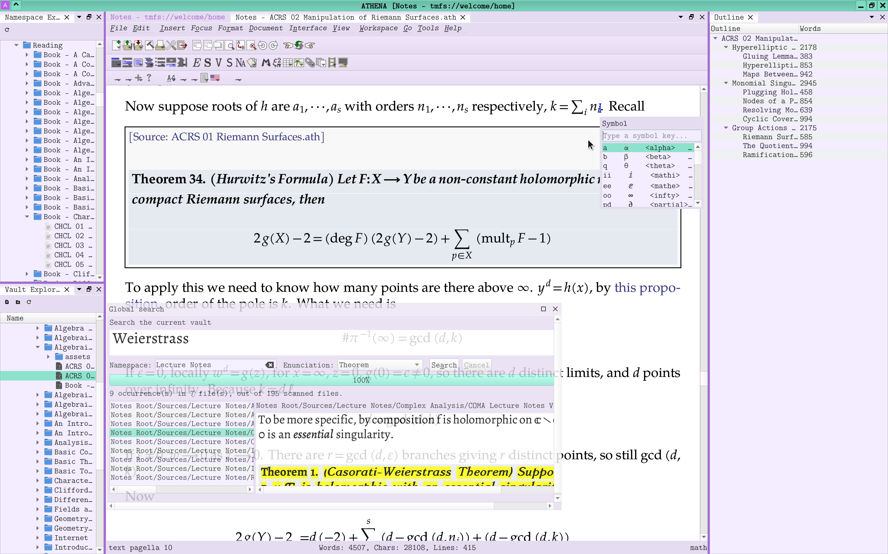

# ATHENA

<p align="center">
  
</p>

**Advanced Typesetting and Hypertext Environment for Notes and Archives**

ATHENA is a mathematics-centered knowledge-work environment derived from GNU
TeXmacs. It keeps structured WYSIWYG mathematical editing and high-quality
typesetting while developing its own document, vault, search, linking, and
knowledge-management model.



ATHENA is not a conservative TeXmacs distribution and is not intended to be a
drop-in replacement for upstream TeXmacs. The primary ATHENA document format is
`.ath`, the executable is `ATHENA.bin`, and the user configuration directory is
`~/.ATHENA`.

## Scope

ATHENA is designed for large structured mathematical note collections. Its main
workflows center on vaults, wikilinks and transclusions, Materials and citations,
namespaces, structural search, mathematical editing, and native Qt tools. The
application also uses per-buffer execution actors so mutable editor, document,
typesetting, and buffer-bound Scheme state remain owned by the corresponding
buffer.

Many inherited TeXmacs subsystems that do not fit this direction have been
removed rather than kept for compatibility. ATHENA therefore favors its own
maintained workflows over preserving the full historical TeXmacs feature set.

## Compatibility with GNU TeXmacs

Compatibility is not guaranteed in either direction.

Upstream TeXmacs is not expected to understand ATHENA-specific document nodes,
vault semantics, or other ATHENA extensions. Conversely, ATHENA does **not**
guarantee that it can open an upstream TeXmacs document correctly. Support for
many older TeXmacs features and subsystems has been removed, so upstream
documents that depend on those features may fail to load correctly, lose
unsupported structure, or behave differently in ATHENA.

Treat `.ath` as the native ATHENA format. If interchange with another system is
required, use an explicitly supported export format and verify the result.

## New in 0.10

This is a **source-only release**, like 0.9. The changes since 0.9 include:

- **UTF-8 and XML documents.** Native text uses Unicode grapheme boundaries;
  `.ath` documents use XML v2, with typed node properties and optional persistent
  UUIDs. Native styles use ATS XML. Unicode font selection uses ATHENA's font
  infrastructure with HarfBuzz and FreeType, without Pango. PDF export uses the
  native backend, not a PostScript-to-Ghostscript conversion.
- **Source-owned identities.** Paragraphs, headings and canonical enunciations
  have document-owned identities. Wikilinks and ordered multi-node transclusions
  resolve those identities through a rebuildable location cache, rather than
  generated anchor pairs or recovery hints. Enunciations carry their kind and
  structured metadata as properties. Artifacts bind to source identities.
- **An application-owned workspace.** Native C++ menus, toolbars and command
  dispatch use declarative JSON resources. The menubar, command palette and
  application shortcuts work beyond the editor; closing all buffers leaves
  ATHENA open. Editor toolbars remain view-owned, and documents have their own
  tabs. Generic editing and keyboard handling have also moved substantially
  from Scheme to native code.
- **Continuous knowledge processing.** UUID indexing, maintenance, artifact
  extraction and NPU RAG share background status and error reporting. Realtime
  artifact overlays make newly edited definitions available to radioactive-link
  matching. Optional Intel NPU embedding uses an isolated OpenVINO worker to
  converge the active vault, rather than treating each save as a priority job.
- **Saving and backups.** Realtime save, document history and recovery accompany
  SQLite-aware backup dispatch, so live database sidecars are not copied as
  ordinary stable files.
- **Native drawing and external plugins.** Drawing includes freehand and shape
  tools, recognition, lasso transforms, horizontal/vertical space insertion and
  trimming. AUDM/AUDMAP provides authenticated external interoperation, managed
  subprocess plugins, C++/Python clients and a REPL. Document model v3 exposes
  node identities and properties; the Hello World example is under
  `ATHENA/examples`.

### Upgrading an Existing Vault

Back up the vault and close **all** programs using it before offline migration.
For a legacy 0.9 vault, run the format upgrade first, then the node-model upgrade:

```sh
ATHENA/bin/ATHENA.bin --upgrade-vault-format /path/to/vault
ATHENA/bin/ATHENA.bin --upgrade-vault-node-model /path/to/vault
```

An already UTF-8/XML v1 vault needs only the second step. These are headless,
transactional upgrade modes with validation and recovery snapshots. Read their
diagnostics, including unresolved legacy references, before resuming editing.
Do not delete artifact databases to upgrade: migration preserves their identities
and associated results. Keep the backups; older ATHENA versions cannot be
expected to read the upgraded format or document-model protocol.

## Building ATHENA

The complete compilation guide is available in several forms:

- [COMPILE.ath](./COMPILE.ath) — build-guide source, including the updated
  0.10 application build commands.
- [COMPILE.pdf](./COMPILE.pdf) — historical pre-rendered build documentation;
  its commands may lag behind the source and the explicit target below.
- [COMPILE.tex](./COMPILE.tex) — LaTeX build guide with updated application
  build commands; compile it with a LaTeX distribution if needed.

[COMPILE](./COMPILE) is only a short pointer to these documents.

The currently supported build target is x86-64 GNU/Linux with Qt 6 and native
Wayland. See the compilation guide for the tested environment, dependencies,
native builds, package builds, and the status of other platforms.

For an existing configured `build_qt6` tree, build the application explicitly:

```sh
cmake --build build_qt6 --target ATHENA.bin -j20
```

Do not substitute the default ALL target. Optional NPU RAG additionally needs a
working Intel NPU driver/OpenVINO installation and compatible model/tokenizer
files; model weights are not part of this source-only release.
The 0.10 dependency set includes ICU (uc/i18n) and LMDB development libraries
in addition to HarfBuzz and FreeType; Pango is no longer a dependency.

## Documentation

After starting ATHENA, use the documentation under the Help menu. The manual is
still under construction. Additional project information is available at
[athena.evalisk.org](https://athena.evalisk.org/).

The welcome and getting-started pages describe 0.10. Much of the inherited
reference manual still uses legacy help markup and may describe retired
features; a wider documentation rewrite is planned for 1.0. This retained help
format is not the native format for newly saved user documents.

## Status

ATHENA 0.10 is under active development. Interfaces, document structures, and
workflows may still change as the project develops.

## Licensing

ATHENA is free software under the GNU General Public License, version 3 or
later. See [LICENSE](./LICENSE), [COPYING](./COPYING), and
[ATHENA/COPYING](./ATHENA/COPYING).

Copyright (C) 1998-2026 Joris van der Hoeven and others.

Copyright (C) 2026 Nuaptan Felix Evalisk.
